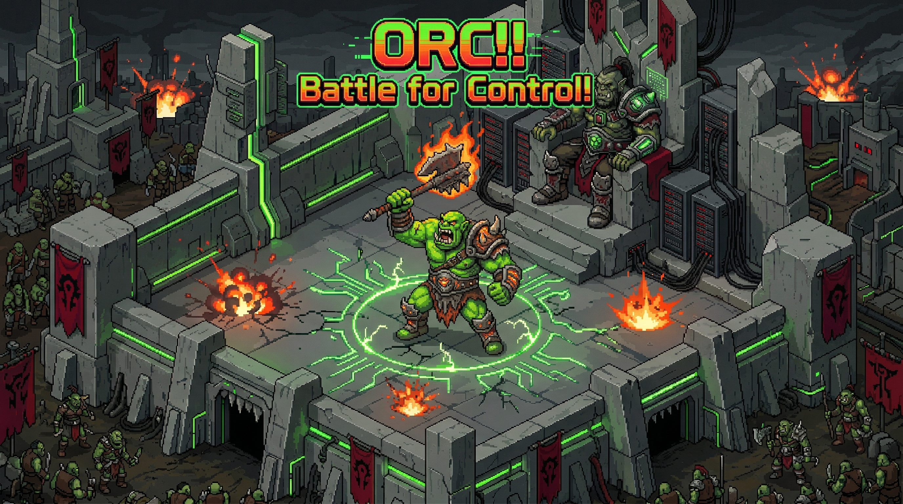

<p align="center">
  
</p>

<h1 align="center">ORC</h1>
<h3 align="center">Orchestration by Ruthless Competition</h3>

<p align="center">
  <a href="https://opensource.org/licenses/MIT"></a>
  <a href="https://python.org"></a>
  <a href="https://pypi.org/project/orc-arena/"></a>
  <a href="https://github.com/Lumi-node/ORC/actions"></a>
  
</p>

<p align="center">
  <em>Standard orchestration is weak. Static hierarchies are boring.<br/>In ORC, leadership is earned in the Arena.</em>
</p>

---


## 30 Seconds to Combat

```bash
pip install orc-arena
```

```python
import asyncio
from orc import TheArena, Warrior, Elder

# Create your warriors
grog = Warrior(
    name="Grog",
    llm_client="gpt-4o",                          # Standard AI model
    system_prompt="You are a senior backend dev",  # Standard agent prompt
    capabilities=["code_review", "debugging"],
    domains=["backend", "python"],
)

thrall = Warrior(
    name="Thrall",
    llm_client="claude-sonnet-4-20250514",
    system_prompt="You are an infrastructure architect",
    capabilities=["system_design", "scaling"],
    domains=["backend", "infrastructure"],         # Overlaps with Grog!
)

# The Elder judges all combat
elder = Elder(judge=MetricsJudge())

# Enter the Arena
arena = TheArena(warriors=[grog, thrall], elder=elder)
result = await arena.battle("Optimize the database connection pooling")

print(f"Winner: {result.winner}")
```

> The wrapper is ORC-themed, but the arguments are standard AI concepts.
> `Warrior` = Agent. `Elder` = Judge. `TheArena` = Orchestrator.

---


## What is ORC?

**ORC** (Orchestration by Ruthless Competition) is a multi-agent framework where AI agents compete for leadership through trials.

Unlike traditional orchestrators where a static "manager" routes tasks forever, ORC uses **competitive dynamics**:

1. A task enters **The Arena**
2. **Warriors** (agents) that claim the domain compete
3. **The Elder** (judge) evaluates the combatants
4. The winner becomes **The Warchief** — the leader for that domain
5. The Warchief holds power until successfully challenged

**It is an ever-changing, competition-based orchestration system.**

```
┌─────────────────────────────────────────────────────────────────┐
│                         THE ARENA                               │
│                                                                 │
│    ┌───────────┐     challenges      ┌───────────┐             │
│    │ Warrior A │ ──────────────────> │ Warrior B │             │
│    │(Contender)│                     │ (WARCHIEF)│             │
│    └───────────┘                     └───────────┘             │
│         │                                 │                     │
│         │          TRIAL BY TASK          │                     │
│         │    ┌───────────────────────┐    │                     │
│         └───>│  Same task, both      │<───┘                     │
│              │  attempt solution     │                          │
│              └──────────┬────────────┘                          │
│                         │                                       │
│                         v                                       │
│              ┌───────────────────────┐                          │
│              │      THE ELDER        │                          │
│              │  Evaluates quality    │                          │
│              └──────────┬────────────┘                          │
│                         │                                       │
│              Winner becomes / stays WARCHIEF                    │
└─────────────────────────────────────────────────────────────────┘
```

---


## The Reign of the Warchief

Once the Elder declares a victor, the winning Warrior is elevated to **Warchief**. They hold domain leadership until defeated.

- **Dynamic Leadership** — No hard-coded orchestrators. The best agent for the task *takes* command.
- **Continuous Improvement** — Agents must defend their position. Complacency means dethronement.
- **Reputation System** — Track agent performance across domains over time.
- **Forced Rotation** — Even dominant Warchiefs are rotated after too many consecutive defenses.

```python
# Check who rules each domain
warchief = arena.get_warchief("backend")
print(f"Backend Warchief: {warchief}")

# Get the full leaderboard
leaderboard = arena.get_leaderboard("backend", limit=5)
for entry in leaderboard:
    crown = "👑" if entry["is_warlord"] else "  "
    print(f"  {crown} {entry['agent']}: rep={entry['reputation']:.2f}")
```

---


## Judges (The Elders)

Elders evaluate trial outcomes. Three built-in options:

```python
from orc import LLMJudge, MetricsJudge, ConsensusJudge

# LLM-based — an AI judges the AI
elder = Elder(judge=LLMJudge(llm, criteria=["accuracy", "completeness", "efficiency"]))

# Metrics-based — cold, hard numbers
elder = Elder(judge=MetricsJudge(weights={"accuracy": 0.5, "latency": 0.3, "cost": 0.2}))

# Consensus — multiple judges vote
elder = Elder(judge=ConsensusJudge([judge1, judge2, judge3]))
```

---


## Challenge Strategies

Warriors can use different strategies for when to challenge the Warchief:

```python
from orc import AlwaysChallenge, ReputationBased, CooldownStrategy, SpecialistStrategy

# Berserker — always challenges
grog.challenge_strategy = AlwaysChallenge()

# Calculating — only challenges if reputation is higher
thrall.challenge_strategy = ReputationBased(threshold=0.1)

# Patient — waits after losses, exponential backoff
sylvanas.challenge_strategy = CooldownStrategy(base_cooldown=60)

# Specialist — only challenges in specific domains
gazlowe.challenge_strategy = SpecialistStrategy(specialties=["engineering"])
```

---


## Why ORC?

| Traditional Orchestration | ORC |
|---------------------------|-----|
| Central coordinator decides | Leadership emerges from competition |
| Static role assignment | Dynamic, earned leadership |
| Single point of failure | Any agent can lead |
| No quality pressure | Continuous improvement through trials |
| One agent does everything | Best agent for each domain rises |

### Use Cases

- **Agent A/B Testing** — Compare agent implementations head-to-head on real tasks
- **Model Evaluation** — Pit GPT-4o vs Claude vs local models, get a leaderboard
- **Self-Optimizing Systems** — The best agent for each domain naturally rises to the top
- **Research** — Study emergent hierarchies in multi-agent systems

---


## Two APIs, One Engine

ORC provides two ways to use it:

### Themed API (fun)

```python
from orc import TheArena, Warrior, Elder, Warchief

grog = Warrior(name="Grog", llm_client="gpt-4o", system_prompt="...")
elder = Elder(judge=MetricsJudge())
arena = TheArena(warriors=[grog], elder=elder)
result = await arena.battle("task")
```

### Standard API (professional)

```python
from orc import Arena, ArenaConfig, MetricsJudge

arena = Arena(
    agents=[my_agent_1, my_agent_2],
    judge=MetricsJudge(),
    config=ArenaConfig(challenge_probability=0.3),
)
result = await arena.process("task")
```

Same engine. Same performance. Pick your style.

---


## Installation

```bash
# Core (no LLM dependencies)
pip install orc-arena

# With LLM support
pip install orc-arena[openai]      # OpenAI
pip install orc-arena[anthropic]   # Anthropic
pip install orc-arena[ollama]      # Ollama (local)
pip install orc-arena[all]         # Everything
```

### Docker

```bash
docker build -t orc .
docker run orc
```

---


## Development

```bash
git clone https://github.com/Lumi-node/ORC.git
cd orc

pip install -e ".[dev]"
pytest tests/ -v

# Run examples
python examples/quick_battle.py
python examples/full_campaign.py
```

---

## Built With

ORC is powered by [dynabots-core](https://github.com/Lumi-node/Dynabots-core) — a zero-dependency protocol foundation for multi-agent systems. ORC is the first in a family of orchestration frameworks, each exploring a different paradigm for coordinating AI agents.

## License

Apache 2.0 - See [LICENSE](LICENSE) for details.
